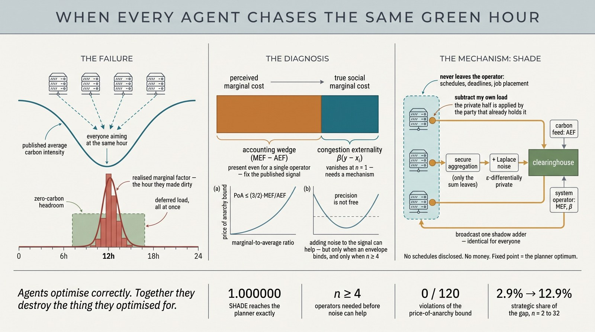
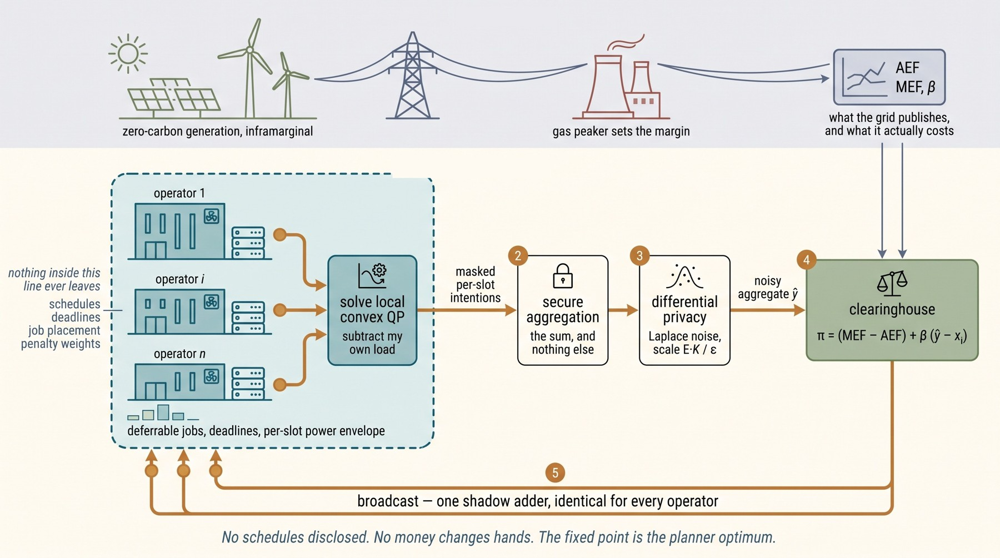

# green-hour



Simulator, analytic oracles, and reproducible experiments for **"When Every
Agent Chases the Same Green Hour: Equilibrium Inefficiency and Mechanism Design
for Competing Carbon-Aware Datacenter Schedulers."**

Cloud operators increasingly delegate workload placement to agents that shift
flexible computation toward hours of low grid carbon intensity. Each agent
optimises its own operator's emissions correctly, but they all read the same
public signal, so their decisions correlate and deferred load concentrates into
the same hours — met by marginal generation, which is precisely the
carbon-intensive capacity the agents were avoiding.

This repository models that as an atomic splittable congestion game over time
slots, and contains everything needed to reproduce the paper's theoretical
claims.

---

## Status

The theory and the simulator are complete and tested. The empirical calibration
(dispatch-response estimation from grid data) is **not** in this repository yet;
see [Provenance](#provenance) below. Nothing here should be read as a measured
result about any real balancing authority.

## Protocol



Operators solve locally and emit only masked per-slot intentions. The
clearinghouse combines a differentially private aggregate with the system
operator's dispatch slope and broadcasts one shadow adder, identical for every
operator; each operator subtracts its own contribution locally. Nothing inside
the dashed boundary is ever disclosed.

## Install

Requires Python 3.9+, `numpy` and `scipy`. Nothing else.

```bash
pip install numpy scipy
```

## Reproduce

```bash
# solver validation and analytic oracles
cd tests
python test_solver.py          # fast QP primitive vs scipy SLSQP, 400 instances
python test_game.py            # 9 analytic oracles for the game layer

# experiments; each writes results/<EID>.{tex,json} with a provenance header
cd ../experiments
python V1_model_cap.py         # the emissions model's ceiling on eta
python V2_precision.py         # when a noisier signal helps, and when it does not
python V3_two_slot.py          # the exact two-slot proposition
python V4_shade_fixpoint.py    # mechanism variants and damping stability
python V5_bound_and_scaling.py # price-of-anarchy bound, and scaling
python V6_decomposition.py     # accounting vs strategic split of the gap
python V7_privacy.py           # privacy sweep at the true round count
```

Runtimes range from seconds (V1) to about twenty minutes (V5, V7) on a laptop.

## What is here

```
src/gh/core.py        model, feasible sets, the separable-QP primitive,
                      Nash / planner / wedge-fixed equilibria
src/gh/instances.py   instance generators
src/gh/mech.py        SHADE, its four variants, the privacy layer
src/gh/baselines.py   ten baselines
tests/                solver validation and analytic oracles
experiments/          one runner per experiment
results/              generated; never hand-edited
```

### The solver

Every equilibrium concept reduces to one primitive: minimise a separable convex
quadratic over

```
X_i = { x >= 0 : sum_t x_t = E_i,  x_t <= u_t,  sum_{tau<=t} x_tau >= R_t }
```

the set of feasible schedules for one operator's deferrable work under a power
envelope and a cumulative deadline staircase. It is solved exactly and without
iteration: stationarity makes the aggregate a monotone piecewise-linear function
of the equality multiplier, so we sort the `2T` breakpoints, accumulate slope and
intercept, and solve one linear equation. The deadline staircase is handled by
polymatroid decomposition on prefixes. `O(T log T)`, exact to machine precision.

Validated against `scipy.optimize.minimize(SLSQP)` on 400 random instances:
worst relative excess **8.2e-13**.

Nash, the planner, and the wedge-fixed intermediate differ only in the linear
coefficient handed to that primitive.

### Correctness evidence

| Check | Result |
|---|---|
| Fast QP vs SLSQP, 400 random instances | worst relative excess 8.2e-13 |
| Potential function is exact | 4.3e-12 |
| No profitable unilateral deviation at the computed Nash | max relative gain 9.2e-15 |
| Uniqueness: 20 random starts | spread 9.6e-11 |
| Planner via Minkowski-sum reduction vs block coordinate descent | 3e-14 |
| Two-slot fast solver vs general best response | 2e-13 |
| Price-of-anarchy bound violations, 120 random instances | 0 |

The planner reduction is worth noting: with no deferral penalty the social cost
depends on the profile only through the aggregate, and these feasible sets are
polymatroid base polytopes whose Minkowski sum is a polytope of the same form.
The planner therefore collapses to a single QP in the aggregate.

## Provenance

**No measured grid data is used anywhere in this repository.** Instance shapes
are physically plausible but constructed, and every file in `results/` carries a
`provenance` field marking it `SYNTHETIC` or `ARITHMETIC`.

The experiments here validate mathematics and code — closed forms, thresholds,
fixed points, bound validity. They are not empirical claims about CAISO, ERCOT,
PJM, Great Britain or Germany, and none of them should be used to populate a
results table about those regions.

One generator parameter has no analogue in a real feed: `kappa`, the ratio of the
congestion increment to the accounting wedge at the reference flexible share. The
accounting/strategic split of the equilibrium gap is roughly proportional to it,
so calibrating `kappa` against real dispatch data is the measurement that
determines how much of the problem is a signal-design problem and how much needs
a mechanism.

## Citation

```bibtex
@inproceedings{greenhour,
  title     = {When Every Agent Chases the Same Green Hour: Equilibrium
               Inefficiency and Mechanism Design for Competing Carbon-Aware
               Datacenter Schedulers},
  booktitle = {Proceedings of the International Conference on Autonomous Agents
               and Multiagent Systems (AAMAS)},
  year      = {2027}
}
```

## License

MIT. See `LICENSE`.
